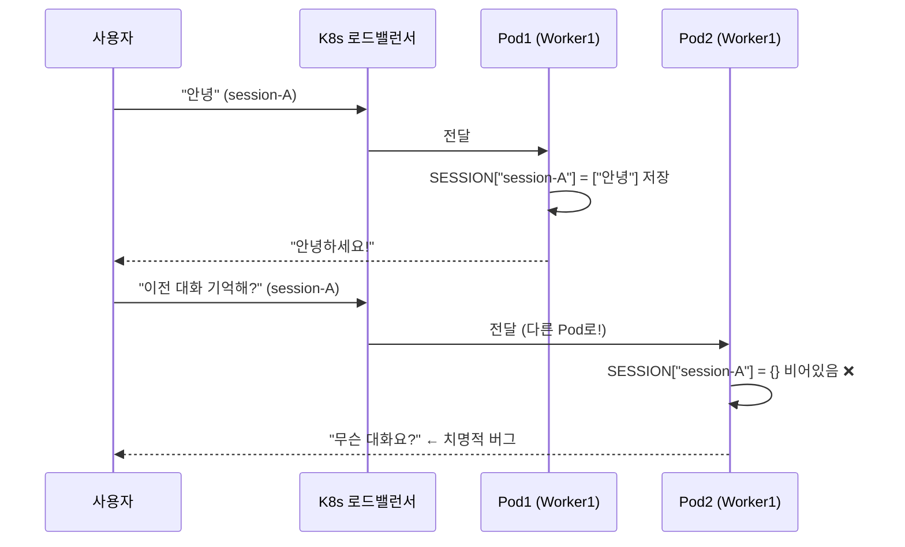

# 🚀 로드맵 1단계: Gunicorn과 Uvicorn의 조화 (Worker & Process 심층 분석)

> 이 프로젝트의 현재 인프라(Dockerfile, Helm, HPA)를 기반으로 실무 시스템 엔지니어링 관점에서 설명합니다.

---

## 1. 🤔 현재 우리 서버는 어떻게 실행되고 있나요?

현재 `dockerfile`의 마지막 줄을 보면:

```dockerfile
# dockerfile (AS-IS) - 개발용 단일 프로세스
CMD ["sh", "-c", "python -m uvicorn app.main:app --host 0.0.0.0 --port 8080"]
```

이 명령어는 **단 1개의 Uvicorn 프로세스**를 띄웁니다.
문제는 이 1개 프로세스가 다운되거나 처리 속도가 느려지면 **모든 요청이 멈춰버린다**는 것입니다.

> **목표:** 이 서버를 실전 트래픽을 처리할 수 있는 `Gunicorn + Uvicorn Worker` 조합으로 업그레이드하자!

---

## 2. 🔧 Uvicorn 단독 vs Gunicorn + Uvicorn Worker

### 역할 분리 이해하기

```
┌─────────────────────────────────────────────────────────┐
│                  클라이언트 (브라우저/앱)                   │
└────────────────────────────┬────────────────────────────┘
                             │ HTTP 요청
                             ▼
┌─────────────────────────────────────────────────────────┐
│              🦄 Gunicorn (프로세스 관리자, "감독관")        │
│                                                         │
│  - Worker 프로세스를 생성/재시작/종료 (프로세스 매니저)       │
│  - 요청을 살아있는 Worker에 라운드로빈으로 분배              │
│  - Worker 가 다운되면 자동으로 새로 생성                     │
│                                                         │
│  ┌─────────────┐  ┌─────────────┐  ┌─────────────┐    │
│  │  Uvicorn    │  │  Uvicorn    │  │  Uvicorn    │    │
│  │  Worker 1   │  │  Worker 2   │  │  Worker 3   │    │
│  │  (PID:101)  │  │  (PID:102)  │  │  (PID:103)  │    │
│  │             │  │             │  │             │    │
│  │ FastAPI App │  │ FastAPI App │  │ FastAPI App │    │
│  │ (비동기루프) │  │ (비동기루프) │  │ (비동기루프) │    │
│  └─────────────┘  └─────────────┘  └─────────────┘    │
└─────────────────────────────────────────────────────────┘
```

| 역할 | Uvicorn 단독 | Gunicorn + Uvicorn Worker |
|---|---|---|
| **프로세스 수** | 1개 (싱글 프로세스) | N개 (멀티 프로세스) |
| **CPU 활용** | 1개 코어만 사용 | 모든 코어 병렬 활용 |
| **Worker 다운 복구** | 서버 전체 다운 | Gunicorn이 자동 재시작 |
| **동시 요청 수용량** | 비동기 처리로 수십~수백개 | 워커수 × 비동기 수용량 |
| **용도** | 개발(dev) 환경 | **운영(production) 환경** |

### 📌 핵심 개념 정리

- **Gunicorn** = 군대 지휘관. Worker 병사들을 생성하고, 죽으면 다시 뽑고, 요청을 분배합니다. ASGI 요청은 직접 처리 못합니다.
- **UvicornWorker** = Gunicorn이 뽑은 병사인데, 비동기(ASGI) 전문가. FastAPI가 실제로 돌아가는 곳입니다.
- **--workers N** = 병사 몇 명을 뽑을 것인가. 보통 `(CPU core 수 * 2) + 1`이 공식입니다.

---

## 3. ⚡ Gunicorn Worker 수 vs Kubernetes Pod 수 — 무엇이 다른가?

이 개념을 헷갈리면 "도대체 뭘 몇 개 띄워야 하는 거야?"가 됩니다. 완벽하게 정리합니다.

```
┌─────────────────────────────────────────── Kubernetes 클러스터 ──┐
│                                                                  │
│  ┌──────── Pod 1 (서버 1대) ─────────────────────────────────┐  │
│  │                                                            │  │
│  │  ┌─── Gunicorn (감독관) ────────────────────────────┐     │  │
│  │  │                                                  │     │  │
│  │  │  [UvicornWorker-1]  [UvicornWorker-2]           │     │  │
│  │  │   (FastAPI App)      (FastAPI App)               │     │  │
│  │  │   Port: 8080         Port: 8080                  │     │  │
│  │  └──────────────────────────────────────────────────┘     │  │
│  │                                                            │  │
│  │  CPU: 0.5core   Memory: 512Mi                              │  │
│  └────────────────────────────────────────────────────────────┘  │
│                                                                  │
│  ┌──────── Pod 2 (서버 2대) ─────────────────────────────────┐  │
│  │               (HPA가 부하를 보고 자동으로 생성)               │  │
│  │  ┌─── Gunicorn (감독관) ────────────────────────────┐     │  │
│  │  │  [UvicornWorker-1]  [UvicornWorker-2]           │     │  │
│  │  └──────────────────────────────────────────────────┘     │  │
│  └────────────────────────────────────────────────────────────┘  │
│                                                                  │
│  ↑ K8s Service (로드밸런서) 가 Pod 1, Pod 2 에 트래픽을 분산     │
└──────────────────────────────────────────────────────────────────┘
```

### 한 줄 요약 비교표

| 구분 | Gunicorn Worker 수 | Kubernetes Pod 수 (HPA) |
|---|---|---|
| **단위** | 단일 머신(Pod) 안의 **프로세스** | 쿠버네티스 위의 **컨테이너(서버 인스턴스)** |
| **목적** | **CPU 코어를 전부 활용** | **트래픽 급증 시 서버 자체를 늘림** |
| **확장 방향** | 수직적 (한 서버에서 더 많이 처리) | 수평적 (서버 자체를 복제) |
| **결정 주체** | 개발자 (values.yaml에 설정) | K8s HPA (CPU/Memory 메트릭 자동 판단) |
| **메모리 공유** | 같은 Pod라도 Worker끼리 **메모리 공유 안 함** | Pod끼리 메모리 공유 **절대 안 됨** |

> **실무 조합 공식:** "Pod 1개당 CPU 코어에 맞게 Worker를 맞추고, Pod는 HPA가 알아서 늘리게 한다"

---

## 4. 🚨 여러 Pod/Worker 환경에서 무너지는 것들

### 4-1. 세션 히스토리 (In-Memory)

우리 프로젝트에 `ChatInMemoryRepository`가 있습니다.

```python
class ChatInMemoryRepository:
    SESSION_STORAGE: dict[str, list[dict[str, str]]] = {}  # 🚨 이게 문제!
```

같은 Pod1 내 Worker1, Worker2끼리도 ChatInMemoryRepository 공유 안 되나요?
 네, 공유 안 됩니다. 같은 Pod 안이어도 마찬가지입니다.
 ```
 Pod1 (하나의 컨테이너)
├── Gunicorn Master Process (PID: 100)
│     ↓ fork()
├── UvicornWorker-1 (PID: 101) ← 독립된 메모리 공간
│   └── SESSION_STORAGE = {"user-A": [...]}   ✅ 여기 저장됨
│
└── UvicornWorker-2 (PID: 102) ← 완전히 다른 메모리 공간
    └── SESSION_STORAGE = {}                  ❌ 비어있음
 ```

이 딕셔너리는 **해당 프로세스의 메모리 안에만 존재**합니다.

```
시나리오: Pod가 2개, Worker가 2개인 경우

사용자가 "안녕"이라고 보냄
→ K8s 로드밸런서가 Pod1의 Worker1으로 전달
→ Worker1의 SESSION_STORAGE에 {"session-A": ["안녕"]} 저장 ✅

사용자가 "이전 대화 기억해?" 라고 보냄
→ K8s 로드밸런서가 Pod2의 Worker1으로 전달
→ Pod2의 SESSION_STORAGE는 {} 비어있음 ❌

결과: "무슨 대화요?" → 채팅 히스토리 날아감!
```



**해결책:**
| 방법 | 설명 | 난이도 |
|---|---|---|
| **Redis 세션 저장소** | 외부 공유 메모리(Redis)에 세션 저장 → 어느 Pod든 읽기 가능 | ⭐⭐ |
| **Sticky Session (K8s)** | 같은 사용자의 요청을 항상 같은 Pod로만 보내도록 Service 설정 | ⭐ |
| **Supabase 세션 테이블** | DB에 히스토리를 저장하면 모든 Pod/Worker가 공유 가능 | ⭐ |

### 4-2. Request ID 로깅 연속성

분산 환경에서 하나의 사용자 요청을 추적하려면 request-id가 **모든 Pod에서 같은 값**이어야 합니다.
그렇지 않으면 로그 분석 시 "이 에러가 어느 Pod에서 났는지" 파악이 불가능합니다.

**해결책:** HTTP 헤더(`X-Request-ID`)를 클라이언트 또는 게이트웨이에서 생성하여 넣고, 백엔드는 그것을 그대로 읽어 쓴다. (우리 프로젝트의 미들웨어에 추가할 수 있음)

지금처럼 middleware에서 request-id를 생성하는 것은 Pod가 달라도 문제없습니다. Pod2가 요청을 받으면 Pod2가 새로운 Request 객체를 만들고 거기에 trace_id를 붙이기 때문입니다. 핵심은 클라이언트가 HTTP 헤더에 trace-id: abc-123을 담아 보내면, 어느 Pod/Worker가 받아도 동일한 ID를 유지할 수 있다는 점입니다. 현재 코드가 request.headers.get("trace-id")로 헤더 우선 로직을 갖추고 있으므로 이 설계가 완벽합니다

---

## 5. 🌊 SSE 스트리밍과 다중 Pod/Worker 환경

### 스트리밍 요청의 특수성

```
일반 HTTP 요청:  클라이언트 → 요청 → [Pod] → 응답 → 연결 종료 (짧음)

SSE 스트리밍:    클라이언트 → 요청 → [Pod] → chunk1 → chunk2 → ... → [DONE] → 연결 종료
                                         ↑ 이 연결이 수십 초~수 분간 유지됨!
```

SSE(Server-Sent Events)는 **1개의 HTTP 연결이 오래 살아 있는 Long-lived Connection**입니다. 이 특성 때문에 주의해야 할 점이 있습니다.

| 상황 | 결과 |
|---|---|
| **Pod가 2개 있을 때**, 스트리밍 도중 해당 Pod가 재시작됨 | 연결이 끊기고 클라이언트는 불완전한 응답을 받음 |
| **Worker가 2개** 있을 때, Worker1이 스트리밍 시작 | Worker2가 중간에 개입할 수 없음. 연결은 Worker1이 끝낼 때까지 독점 |
| **Gunicorn의 timeout** 이 짧으면 (예: 30초) | 30초 넘는 LLM 응답이 잘릴 수 있음 |

### 핵심 결론
- **스트리밍은 하나의 Worker가 처음부터 끝까지 독점 처리**합니다. 중간에 다른 Worker나 Pod로 이전이 절대 불가능.
- Pod가 2개여도 한 번 연결되면 그 Pod가 스트리밍을 끝까지 처리합니다 (K8s 로드밸런서는 연결 초기에만 분배).
- 따라서 **Gunicorn의 `timeout` 값을 LLM 응답 최대 시간 이상으로 넉넉하게** 설정해야 합니다.

---

## 6. 🛠️ 실습: 우리 프로젝트에 Gunicorn 적용하기

### Step 1. Gunicorn 설정 파일 생성

> 설정값은 `values.yaml` → `configmap.yaml` → 환경변수(`ENV`) 경로로 주입합니다.

```python
# backend/gunicorn_conf.py (신규 생성)
import os

# ============================================================
# Gunicorn 운영 설정
# 모든 값은 환경변수(ENV)에서 읽어옵니다.
# 하드코딩은 절대 금지! 설정은 values.yaml에서 관리합니다.
# ============================================================

# 1. 서버 바인딩 (HOST:PORT)
host = os.getenv("APP_HOST", "0.0.0.0")
port = os.getenv("APP_PORT", "8080")
bind = f"{host}:{port}"

# 2. 워커(Worker) 개수
# values.yaml의 service.worker 값이 ENV로 주입됩니다.
workers = int(os.getenv("GUNICORN_WORKERS", "1"))

# 3. 워커 클래스: Uvicorn의 ASGI 비동기 워커 사용 (FastAPI와 호환)
worker_class = "uvicorn.workers.UvicornWorker"

# 4. 로그 레벨 (values.yaml의 env.app.log_level과 연동)
loglevel = os.getenv("APP_LOG_LEVEL", "info")
accesslog = "-"   # stdout (K8s 로그 수집기가 가져감)
errorlog = "-"    # stderr

# 5. SSE 스트리밍을 위한 타임아웃 설정 (매우 중요!)
# LLM 스트리밍은 수십 초가 걸릴 수 있으므로 기본 30초보다 넉넉하게 설정합니다.
timeout = int(os.getenv("GUNICORN_TIMEOUT", "120"))
keepalive = 5

# 6. Graceful 종료 (Pod가 죽을 때 처리 중인 요청을 완료하고 죽음)
graceful_timeout = 30
```

### Step 2. values.yaml에 Worker 설정 추가

```yaml
# backend/helm/values.yaml (수정 제안)
service:
  port: 80
  targetPort: 8080
  worker: 2       # 👈 이 값이 GUNICORN_WORKERS 환경변수로 주입됩니다.
```

### Step 3. configmap.yaml에 환경변수 추가

```yaml
# backend/helm/templates/configmap.yaml (수정 제안)
data:
  APP_NAME: {{ .Values.env.app.name | quote }}
  APP_HOST: {{ .Values.env.app.host | quote }}
  APP_PORT: {{ .Values.env.app.port | quote }}
  APP_LOG_LEVEL: {{ .Values.env.app.log_level | quote }}
  # 👇 추가
  GUNICORN_WORKERS: {{ .Values.service.worker | quote }}
  GUNICORN_TIMEOUT: "120"
```

### Step 4. Dockerfile 실행 명령어 교체

```dockerfile
# backend/dockerfile (수정 제안)
FROM python:3.12-slim

WORKDIR /app
ENV PYTHONPATH=/app

COPY requirements.txt .
RUN pip install --no-cache-dir -r requirements.txt

# gunicorn_conf.py도 복사!
COPY gunicorn_conf.py /app/gunicorn_conf.py
COPY app/ /app/app/

EXPOSE 8080

# ✅ uvicorn 단독 실행 → gunicorn + uvicorn worker 조합 실행으로 교체
CMD ["gunicorn", "-c", "gunicorn_conf.py", "app.main:app"]
```

---

## 7. 🎯 최종 아키텍처 전체 흐름도

```
[values.yaml]
  service.worker: 2
  hpa.maxReplicas: 5
        │
        ▼
[configmap.yaml]
  GUNICORN_WORKERS: "2"
  GUNICORN_TIMEOUT: "120"
        │
        ▼ (환경변수 주입)
[Pod 1 / Container]
  Gunicorn (gunicorn_conf.py 읽음)
  ├── UvicornWorker-1 (FastAPI)  ← 동시 요청 처리 (비동기)
  └── UvicornWorker-2 (FastAPI)  ← 동시 요청 처리 (비동기)

[Pod 2 / Container] ← HPA가 CPU 70% 이상이면 자동 생성
  Gunicorn
  ├── UvicornWorker-1 (FastAPI)
  └── UvicornWorker-2 (FastAPI)

[K8s Service] ← Pod1, Pod2에 트래픽을 라운드로빈으로 분산
```

---

## 8. 📊 설정 가이드: 서버 성능 사이징

현재 `values.yaml`의 리소스 설정과 Worker 수의 올바른 조합 가이드입니다.

| Pod CPU 요청 | 권장 Worker 수 | 이유 |
|---|---|---|
| `256m` (0.25 core) | **1** | 1개 이상이면 Worker끼리 CPU 경합 발생 |
| `500m` (0.5 core) | **1~2** | 가뿐하게 2개 가능 |
| `1000m` (1 core) | **2~3** | (1 × 2) + 1 = 3 공식 적용 |
| `2000m` (2 core) | **4~5** | 충분한 병렬 처리 가능 |

> ⚠️ **현재 우리 설정** (`requests.cpu: 256m`)에서 `worker: 2` 로 설정하면 CPU가 부족해 Worker끼리 싸울 수 있습니다!  
> Pod CPU 요청을 `500m` 이상으로 올리거나, 일단 worker를 `1`로 유지하고 Pod를 HPA로 늘리는 전략이 현실적입니다.

---

## 9. 🔑 핵심 요약

1. **Gunicorn은 감독관, UvicornWorker는 병사** - Gunicorn이 여러 UvicornWorker를 관리하며 안정성을 높입니다.
2. **Worker 수 = CPU 코어 활용 / Pod 수 = 서버 수평 확장** - 둘은 완전히 다른 레이어입니다.
3. **In-Memory 세션은 다중 Pod 환경에서 반드시 죽습니다** - Redis 또는 DB로 대체해야 합니다.
4. **SSE 스트리밍은 연결당 1개의 Worker에 독점** - Gunicorn `timeout`을 LLM 최대 응답 시간보다 크게 설정해야 합니다.
5. **설정은 코드 안에 절대 하드코딩하지 않습니다** - `values.yaml` → `configmap.yaml` → `ENV` → `gunicorn_conf.py`의 흐름을 유지합니다.

---

## 10. 🗣️ Q&A 회고록

---

### Q1. `gunicorn_conf.py`가 `.yaml`이 아닌 `.py` 파일인 게 일반적인가요?

**A. 네, 업계 표준이자 공식 Gunicorn 문서에 명시된 방식입니다.**

YAML은 정적인 값만 담을 수 있습니다. 하지만 Gunicorn 설정 파일이 Python이면 아래처럼 **런타임에 동적 계산**이 가능합니다.

```python
# gunicorn_conf.py가 .py인 이유
import multiprocessing
import os

# YAML로는 절대 불가능한 동적 계산!
# 서버의 CPU 코어 수를 실행 시점에 읽어서 자동으로 worker 수를 계산합니다.
workers = int(os.getenv("GUNICORN_WORKERS", multiprocessing.cpu_count() * 2 + 1))
```

각 인프라 도구마다 고유한 설정 형식이 존재합니다:

| 도구 | 설정 파일 형식 | 이유 |
|---|---|---|
| **Gunicorn** | `.py` | 동적 계산, Python 생태계 일관성 |
| **Nginx** | `nginx.conf` | 독자적 DSL (Domain Specific Language) |
| **systemd** | `.service` | INI 형식 |
| **Kubernetes** | `.yaml` | 선언형 인프라 표준 |

---

### Q2. CPU 256m + HPA 수평 확장 vs CPU 512m + Gunicorn Worker — 어느 전략이 맞나요?

**A. 무조건 Gunicorn이 좋은 게 아닙니다. 목적이 완전히 다릅니다.**

| 전략 | CPU 설정 | 방식 | 비용 | 핵심 단점 |
|---|---|---|---|---|
| **A. 256m + HPA 수평 확장** | 작게 고정 | Pod 수를 늘려서 처리 | 평소에는 저렴 | Pod Cold Start 10~30초 공백 발생 |
| **B. 512m + Gunicorn 2 Worker** | 크게 고정 | 1개 Pod에서 더 많이 처리 | 항상 CPU 더 예약 | HPA 없으면 트래픽 급증 시 한계 도달 |
| **C. 512m + Gunicorn 2 Worker + HPA** | 중간 | Pod 안 + Pod 수 둘 다 확장 | 가장 비쌈 | 설정 복잡 |

#### 🎯 이 프로젝트에서 **Gunicorn을 반드시 써야 하는 이유 딱 1가지**

**Worker 프로세스가 죽었을 때 자동 복구입니다.** Worker 수를 늘리는 것과 다른 개념입니다.

```
# Uvicorn 단독 (현재 dockerfile) - 위험
python -m uvicorn app.main:app ...
→ 이 1개 프로세스가 메모리 누수/예외로 죽으면?
→ K8s의 livenessProbe가 감지하기 전까지 (수십 초) 요청 전부 실패!

# Gunicorn + UvicornWorker - 안전
→ Worker 1개가 죽어도 Gunicorn Master가 즉시 새 Worker 생성
→ 나머지 Worker가 요청을 계속 처리해서 무중단 유지!
```

#### ✅ 이 프로젝트에 맞는 현실적 권장 전략

```yaml
# values.yaml 권장 방향
containers:
  requests:
    cpu: "256m"     # 비용 효율을 위해 그대로 유지
  limits:
    cpu: "512m"     # 버스트(순간 피크) 허용

service:
  worker: 1         # CPU 256m이므로 Worker 2개는 경합 발생 → 1개만
                    # 단, Gunicorn을 써서 Worker 죽으면 즉시 재시작 안정성 확보!
hpa:
  minReplicas: 1
  maxReplicas: 5    # 트래픽 급증 시 Pod 수평 확장은 HPA에 위임
```

**결론:** `worker: 1`로 고정해도 Gunicorn을 쓰면 **"비용 동일 + Worker 자동 복구 보험"** 을 무료로 얻습니다. Worker를 2개로 늘리기 위해 CPU를 512m으로 올리는 건 상시 비용이 올라가는 비효율적인 선택입니다.

---

### Q3. Worker 1개 + Gunicorn이면 "K8s livenessProbe 감지 전에 복구"된다는 건가요?

**A. 정확히는 "livenessProbe를 기다리지 않고 자체적으로 복구"하는 것입니다. 단, Worker 1개라면 완전한 무중단은 아닙니다.**

```
[Uvicorn 단독]                      [Gunicorn + Worker 1개]

Worker 사망                          Worker 사망
    │                                    │
    ▼                                    ▼ Gunicorn Master가 즉시 감지 (ms 단위)
K8s livenessProbe 감지 대기          새 Worker 생성 시작
(현재 periodSeconds: 720 = 12분!)         │
    │                                약 1~3초 동안 요청 실패 ❌
    │ 최대 12분 요청 전부 실패 ❌         │
    │                                새 Worker 기동 완료 ✅
    ▼
Pod 재시작 (추가 기동 시간 소요)
```

> ⚠️ 현재 우리 `deployment.yaml`의 `readinessProbe.periodSeconds: 720` (12분!)이므로,
> Uvicorn 단독 사용 시 Worker 사망 → **최대 12분 서비스 다운**이라는 치명적 상황이 발생할 수 있습니다.

#### Worker 수에 따른 복구 동작 비교

| 구성 | Worker 사망 시 동작 | 다운타임 |
|---|---|---|
| **Uvicorn 단독** | K8s livenessProbe가 감지할 때까지 대기 | **최대 수분** (periodSeconds 설정 따라) |
| **Gunicorn + Worker 1개** | Gunicorn이 즉시 새 Worker 생성 | **약 1~3초** (새 Worker 기동 시간) |
| **Gunicorn + Worker 2개** | 살아있는 Worker가 요청 계속 받는 동안 죽은 Worker 재시작 | **사실상 0초** (진정한 무중단) |

**결론:**
- Worker 1개 + Gunicorn = "12분 다운" → "3초 미만 다운"으로 극적 단축. 하지만 완벽한 무중단은 아님.
- 진정한 무중단(0초)을 원한다면 → **Worker 2개 + CPU 500m**으로 올리는 트레이드오프가 필요함.
- 이것이 **"비용 최소화하고 3초 미만 다운타임 감수"** vs **"비용 조금 더 쓰고 완벽 무중단"**의 비즈니스 의사결정입니다.
