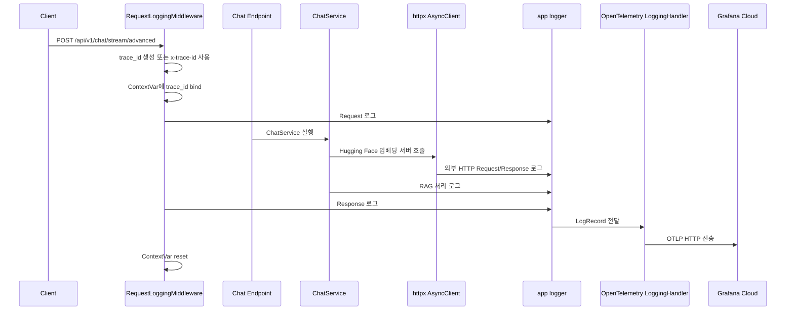

# 5단계 1강: OpenTelemetry + Grafana 로그 관측성 구축

> 목표: FastAPI 백엔드 로그를 OpenTelemetry 표준으로 Grafana Cloud에 전송하고, `trace_id` 기반으로 요청 흐름을 추적할 수 있게 만든다.

---

## 1. 이번 단계에서 완성한 것

이번 5단계 1강에서는 **로그 관측성의 기본 골격**을 만들었다.

| 영역 | 적용 내용 | 이유 |
|---|---|---|
| 로그 수집 | Python `logging` 기반 공통 logger 사용 | 모든 계층에서 같은 방식으로 로그를 남기기 위해 |
| 로그 전송 | OpenTelemetry `LoggingHandler` + OTLP HTTP Exporter | Grafana Cloud로 표준 로그 레코드를 보내기 위해 |
| 로그 저장/조회 | Grafana Cloud | 운영 중 장애 로그를 외부 대시보드에서 보기 위해 |
| 요청 추적 | `x-trace-id` 또는 서버 생성 UUID | 요청 1건의 흐름을 하나의 ID로 묶기 위해 |
| 비동기 컨텍스트 | `ContextVar` | request 객체가 없는 하위 계층에서도 trace id를 사용할 수 있게 하기 위해 |
| 외부 API 관측 | 공통 `httpx.AsyncClient` event hook | Hugging Face 같은 외부 호출의 지연시간과 상태 코드를 남기기 위해 |
| 종료 처리 | OTel provider shutdown, httpx client close | 배치 로그 유실과 커넥션 누수를 줄이기 위해 |

---

## 2. 전체 동작 흐름



핵심은 두 가지다.

1. **로그는 기존 Python logging으로 남긴다.**
2. **OpenTelemetry handler가 그 로그를 Grafana로 전달한다.**

즉, 서비스 코드가 OpenTelemetry SDK를 직접 알 필요가 없다.

---

## 3. 파일별 역할

### `backend/app/base/logger.py`

공통 logger를 만든다.

역할:

- 콘솔 로그 출력
- 파일 로그 저장
- 로그 포맷 통일
- `TraceIdFilter`로 로그 레코드에 `trace_id` 주입

핵심 코드:

```python
class TraceIdFilter(logging.Filter):
    def filter(self, record: logging.LogRecord) -> bool:
        # 모든 로그 레코드에 trace_id 필드를 주입합니다.
        # request context가 없으면 "unknown"이 들어갑니다.
        record.trace_id = get_trace_id()
        return True
```

왜 필요한가?

- `logger.info(...)`를 호출하는 모든 계층에서 동일한 로그 포맷을 사용하기 위해서다.
- `http_client.py`, service, repository처럼 `request` 객체를 직접 받지 않는 영역에서도 현재 요청의 `trace_id`를 가져올 수 있게 된다.

주의:

- Grafana 본문 검색을 확실하게 하려면 메시지 본문에도 명시적으로 trace id를 넣는 방식이 가장 확실하다.
- `TraceIdFilter`는 console/file 포맷과 Python `LogRecord` 확장에 유용하지만, OTel exporter가 custom field를 Grafana에서 어떤 필드로 보여줄지는 별도 확인이 필요하다.

---

### `backend/app/base/context.py`

요청 단위 컨텍스트를 보관한다.

핵심 코드:

```python
_trace_id_ctx_var: ContextVar[Optional[str]] = ContextVar("trace_id", default=None)

def get_trace_id() -> str:
    return _trace_id_ctx_var.get() if _trace_id_ctx_var.get() else "unknown"

def bind_trace_id(trace_id: str) -> Token[str]:
    return _trace_id_ctx_var.set(trace_id)

def reset_trace_id(token: Token[str]) -> None:
    _trace_id_ctx_var.reset(token)
```

왜 `ContextVar`를 쓰는가?

FastAPI는 async 기반이다. 동시에 여러 요청이 같은 프로세스에서 섞여 실행될 수 있다.

전역 변수에 `trace_id`를 저장하면 요청 A의 trace id가 요청 B에 섞일 수 있다. `ContextVar`는 async task 단위로 값을 분리해주기 때문에 요청별 컨텍스트 저장에 적합하다.

`set(None)` 대신 `reset(token)`을 쓰는 이유:

- `bind_trace_id()` 이전 상태로 정확히 되돌릴 수 있다.
- 중첩된 context나 내부 async 작업이 있어도 더 안전하다.

---

### `backend/app/base/middleware.py`

요청 시작과 종료를 감싼다.

역할:

- `x-trace-id` 헤더가 있으면 사용
- 없으면 `uuid4()`로 생성
- `request.state.trace_id`에 저장
- `ContextVar`에 bind
- 요청/응답 로그 기록
- 응답 헤더에 `x-trace-id` 반환
- 요청 종료 시 `reset_trace_id(token)` 호출

핵심 흐름:

```python
trace_id = request.headers.get("x-trace-id") or str(uuid.uuid4())
request.state.trace_id = trace_id
token = bind_trace_id(trace_id)

try:
    response = await call_next(request)
    response.headers["x-trace-id"] = trace_id
    return response
finally:
    reset_trace_id(token)
```

왜 응답 헤더에 `x-trace-id`를 넣는가?

클라이언트나 프론트엔드에서 오류가 발생했을 때 사용자가 전달한 trace id로 서버 로그를 바로 찾을 수 있기 때문이다.

---

### `backend/app/base/opentelemetry.py`

Python logger의 로그를 Grafana Cloud로 전송한다.

역할:

- OpenTelemetry `LoggerProvider` 생성
- Grafana Cloud OTLP endpoint 설정
- Basic 인증 헤더 구성
- 서비스 메타데이터 부여
- `LoggingHandler`를 app logger에 연결
- 앱 종료 시 flush/shutdown

핵심 코드:

```python
provider = LoggerProvider(resource=resource)
exporter = OTLPLogExporter(
    endpoint=endpoint,
    headers=headers,
)
provider.add_log_record_processor(BatchLogRecordProcessor(exporter))
set_logger_provider(provider)

otel_handler = LoggingHandler(
    level=getattr(logging, settings.LOG_LEVEL.upper(), logging.INFO),
    logger_provider=provider,
)

logger.addHandler(otel_handler)
```

왜 `BatchLogRecordProcessor`를 쓰는가?

로그를 1건마다 바로 전송하면 네트워크 비용이 커진다. 배치 processor는 로그를 모아서 전송하므로 성능에 더 유리하다.

왜 shutdown이 필요한가?

배치 버퍼에 남은 로그가 있을 수 있다. 앱 종료 시 `force_flush()`와 `shutdown()`을 호출해야 로그 유실을 줄일 수 있다.

---

### `backend/app/base/http_client.py`

외부 HTTP 호출을 공통화한다.

역할:

- 전역 `httpx.AsyncClient` 재사용
- connection pool 관리
- timeout 정책 중앙화
- 외부 API request/response 로그 기록
- 앱 종료 시 `aclose()`로 연결 정리

핵심 설정:

```python
timeout=Timeout(
    timeout=60.0,
    connect=10.0,
    read=10.0,
    write=10.0,
    pool=5.0,
)
limits=Limits(
    max_connections=100,
    max_keepalive_connections=10,
    keepalive_expiry=30.0,
)
event_hooks={
    "request": [httpx_log_request],
    "response": [httpx_log_response],
}
```

왜 필요한가?

요청마다 `httpx.AsyncClient()`를 새로 만들면 TCP 연결 생성 비용이 계속 발생한다. 공통 client를 재사용하면 성능이 좋아지고, 외부 API 장애 시에도 connection 수를 제한할 수 있다.

---

### `backend/app/main.py`

FastAPI lifespan에서 관측성 자원을 초기화하고 정리한다.

핵심 흐름:

```python
async def life_span(app: FastAPI) -> None:
    await create_engine()
    setup_opentelemetry()

    yield

    await dispose_engine()
    await httpx_client_close()
    shutdown_opentelemetry()
```

왜 lifespan에서 처리하는가?

OpenTelemetry provider, DB engine, HTTP client는 요청마다 만들면 안 되는 무거운 자원이다. 앱 시작 시 한 번 만들고, 종료 시 한 번 정리하는 것이 안정적이다.

---

## 4. 환경 변수

`backend/.env.example` 기준:

```env
APP_NAME=vehicle-manual-poc
APP_ENV=local
LOG_LEVEL=DEBUG

ENABLE_OTEL_DIRECT=false
GRAFANA_ENDPOINT=https://otlp-gateway-prod-ap-northeast-0.grafana.net/otlp/v1/logs
GRAFANA_INSTANCE_ID=1556283
GRAFANA_API_TOKEN=your_grafana_endpoint
```

실제 Grafana 전송을 켤 때:

```env
ENABLE_OTEL_DIRECT=true
GRAFANA_API_TOKEN=실제_Grafana_Cloud_API_Token
```

`ENABLE_OTEL_DIRECT=false`인 경우:

- OpenTelemetry direct export는 비활성화된다.
- console/file 로그는 계속 남는다.
- 로컬 개발에서 Grafana 전송을 원치 않을 때 사용한다.

---

## 5. Grafana에서 확인하는 방법

1. 서버를 실행한다.
2. `/api/v1/chat/stream/advanced` 또는 일반 API를 호출한다.
3. Grafana Cloud Logs 화면으로 이동한다.
4. 아래 기준으로 검색한다.

검색 예시:

```text
vehicle-manual-poc
```

```text
Request-
```

```text
Httpx Response
```

```text
특정 trace_id 문자열
```

확인해야 할 로그:

| 로그 | 의미 |
|---|---|
| `OpenTelemetry direct exporter initialized` | OTel exporter 초기화 성공 |
| `Request-[trace_id] ...` | 요청 진입 로그 |
| `Headers-[trace_id] ...` | 요청 헤더 로그 |
| `[Httpx Request] ...` | 외부 API 호출 시작 |
| `[Httpx Response] ...` | 외부 API 응답 상태/지연시간 |
| `Response-[trace_id] ...` | 요청 완료 로그 |

---

## 6. trace_id 운영 원칙

### 원칙 1: request가 있는 곳은 request.state를 써도 된다

예:

```python
trace_id = getattr(request.state, "trace_id", "unknown")
logger.error(f"[{trace_id}] 요청 처리 중 오류 발생")
```

이 방식은 Grafana 로그 본문 검색에 가장 확실하다.

### 원칙 2: request가 없는 하위 계층은 ContextVar를 사용한다

예:

```python
from app.base.context import get_trace_id

logger.info(f"[{get_trace_id()}] [Httpx Request] {request.method} {request.url}")
```

`http_client.py`, service, repository처럼 `Request` 객체를 받지 않는 계층에서 유용하다.

### 원칙 3: 중복 trace_id는 줄인다

아래처럼 로그 포맷과 메시지에 둘 다 들어가면 중복이 생긴다.

```text
[INFO]...[trace_id=abc] Request-[abc] POST /...
```

운영 검색이 목적이면 메시지 본문에 명시적으로 넣는 방식을 우선하고, formatter 자동 주입은 console/file 편의용으로 판단한다.

---

## 7. 이 단계에서 배운 디자인 패턴

| 패턴 | 적용 위치 | 설명 |
|---|---|---|
| Singleton / Lifespan Resource | `main.py` | 앱 시작 시 한 번 만들고 종료 시 정리 |
| Adapter | `LoggingHandler` | Python logging을 OTel 로그로 변환 |
| Wrapper | `RequestLoggingMiddleware` | 요청 처리 앞뒤에 로깅/trace_id 부여 |
| Context Propagation | `context.py` | async 요청 단위 trace id 전파 |
| Connection Pool | `http_client.py` | 외부 API 연결 재사용 |
| Configuration Externalization | `.env`, `config.py` | endpoint/token/활성화 여부를 코드 밖으로 분리 |

---

## 8. 완료 기준

이 단계는 아래 조건을 만족하면 완료로 본다.

```text
[x] Grafana에서 백엔드 로그가 보인다.
[x] 요청/응답 로그가 남는다.
[x] 외부 HTTP 호출 로그가 남는다.
[x] trace_id로 한 요청의 로그를 찾을 수 있다.
[x] OTel exporter가 앱 시작 시 초기화된다.
[x] 앱 종료 시 OTel provider와 httpx client가 정리된다.
```

따라서 현재 프로젝트 기준으로 **5단계 관측성 기본 과정은 완료**다.

---

## 9. 다음 강의로 넘어가기 전에 기억할 것

OpenTelemetry를 붙였다고 해서 자동으로 모든 문제가 해결되는 것은 아니다.

이번 단계의 핵심은:

```text
로그를 외부로 보낸다.
요청 단위로 묶어 찾을 수 있게 한다.
외부 API 호출의 상태와 지연시간을 남긴다.
```

다음 단계에서는 이 로그를 더 잘 보기 위한 대시보드, 알림, 메트릭, 자동 instrumentation, trace/log correlation을 고도화한다.

