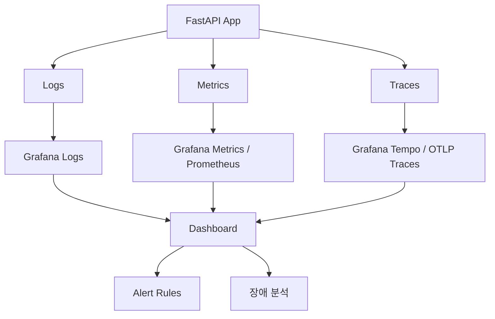

# 5단계 2강: Observability 선택 고도화 매뉴얼

> 목표: 5단계 1강에서 만든 OpenTelemetry + Grafana 로그 관측성을 운영 친화적으로 고도화한다.

---

## 1. 이번 강의의 범위

5단계 1강에서 이미 완료한 것:

```text
FastAPI 로그 → OpenTelemetry LoggingHandler → Grafana Cloud
Request/Response 로그
외부 HTTP 호출 로그
trace_id 기반 요청 추적
```

5단계 2강에서 다룰 선택 고도화:

```text
1. Grafana 알림 룰
2. 대시보드 패널 정리
3. OTel 자동 instrumentation
4. 메트릭 수집
5. trace/log 완전 correlation
```

이 항목들은 5단계 완료를 위해 반드시 필요한 것은 아니지만, 운영 환경에서는 매우 중요하다.

---

## 2. 고도화 전체 그림



1강은 주로 **Logs**를 붙인 단계다.  
2강은 Logs, Metrics, Traces를 한 화면에서 운영 가능하게 만드는 단계다.

---

## 3. Grafana 알림 룰

### 3.1 왜 필요한가?

로그를 사람이 계속 보고 있을 수는 없다.

알림 룰은 장애 신호가 일정 기준을 넘으면 Slack, Email, Teams 같은 채널로 알려주는 장치다.

예:

| 상황 | 알림 조건 |
|---|---|
| 서버 에러 증가 | 5분 동안 `ERROR` 로그 10건 이상 |
| 외부 API 장애 | `Httpx Response -> 5xx` 로그 증가 |
| SSE 장애 | `SSE stream error` 발생 |
| DB 장애 | `Database Error` 발생 |
| 응답 지연 | p95 latency가 3초 초과 |

---

### 3.2 추천 알림 룰

#### Rule 1: 서버 ERROR 로그 증가

목적:

- 예상하지 못한 서버 에러를 빠르게 감지한다.

검색 조건 예시:

```text
level="ERROR"
```

또는 로그 본문 기준:

```text
ERROR
```

알림 기준:

```text
5분 동안 ERROR 로그가 10건 이상이면 알림
```

왜 1건이 아니라 10건인가?

- 운영에서는 일시적 에러 1건만으로 알림을 보내면 피로도가 높아진다.
- 짧은 시간에 여러 건이 몰릴 때 장애 가능성이 높다.

---

#### Rule 2: 외부 임베딩 서버 장애

목적:

- Hugging Face Inference Server 장애를 감지한다.

검색 조건 예시:

```text
Httpx Response
```

그리고 status code가 500 이상인 로그를 필터링한다.

알림 기준:

```text
5분 동안 HF 임베딩 서버 5xx 응답이 3건 이상이면 알림
```

왜 중요한가?

RAG 파이프라인에서 임베딩 서버가 실패하면 검색 자체가 막힌다. LLM은 살아 있어도 답변 품질이 무너질 수 있다.

---

#### Rule 3: SSE 스트리밍 에러

목적:

- 스트리밍 중간 실패를 감지한다.

검색 조건 예시:

```text
SSE stream error
```

알림 기준:

```text
10분 동안 SSE stream error가 5건 이상이면 알림
```

왜 중요한가?

SSE는 일반 HTTP 요청과 달리 `200 OK` 이후에 실패할 수 있다. HTTP status만 보면 정상처럼 보일 수 있으므로 별도 로그 감지가 필요하다.

---

### 3.3 알림 설계 체크리스트

```text
[ ] 알림 이름이 장애 상황을 바로 설명하는가?
[ ] 알림 조건이 너무 민감하지 않은가?
[ ] 1회성 에러와 반복 장애를 구분하는가?
[ ] 알림 메시지에 service.name, APP_ENV, trace_id가 포함되는가?
[ ] 알림을 받는 사람이 바로 다음 행동을 알 수 있는가?
```

좋은 알림 메시지 예시:

```text
[vehicle-manual-poc][prd] HF inference server 5xx errors increased.
Window: 5m
Count: 8
Action: Grafana Logs에서 "Httpx Response"와 trace_id 검색
```

---

## 4. 대시보드 패널 정리

### 4.1 왜 필요한가?

로그만 흩어져 있으면 장애 때 판단이 느리다.

대시보드는 아래 질문에 빠르게 답해야 한다.

```text
지금 서버가 살아 있나?
에러가 늘었나?
외부 API가 느린가?
LLM 호출이 병목인가?
사용자 요청이 어디에서 실패했나?
```

---

### 4.2 추천 대시보드 구성

#### Row 1: 서비스 전체 상태

| 패널 | 목적 |
|---|---|
| Request Count | 요청량 추세 확인 |
| Error Count | 에러 증가 여부 확인 |
| p95 Latency | 느린 요청 감지 |
| Active Environment | local/dev/prd 구분 |

---

#### Row 2: API 요청 로그

| 패널 | 목적 |
|---|---|
| Recent Requests | 최근 요청 목록 |
| Request by Path | 어떤 API가 많이 호출되는지 |
| Response Status | 2xx/4xx/5xx 비율 |
| Slow Requests | 오래 걸린 요청 목록 |

현재 로그 기반으로 볼 수 있는 값:

```text
Request-[trace_id] METHOD PATH CLIENT
Response-[trace_id] METHOD PATH STATUS DURATION
```

---

#### Row 3: 외부 API 호출

| 패널 | 목적 |
|---|---|
| HF Inference Latency | 임베딩 서버 지연시간 |
| HF Status Code | 2xx/4xx/5xx 분포 |
| LLM Error Logs | LLM provider 장애 |
| Supabase Error Logs | DB/RPC 장애 |

현재 `http_client.py` 로그:

```text
[Httpx Request] POST https://...
[Httpx Response] POST https://... -> 200 123.45ms
```

---

#### Row 4: RAG 파이프라인

| 패널 | 목적 |
|---|---|
| Keyword Extraction Logs | 키워드 추출 성공/실패 |
| Embedding Request Logs | 임베딩 호출 상태 |
| RAG Search Logs | 검색 결과 개수/오류 |
| SSE Stream Logs | 스트리밍 종료/오류 |

---

### 4.3 대시보드 설계 원칙

1. **첫 화면에서 장애 여부가 보여야 한다.**
2. **패널은 원인 분석 순서대로 배치한다.**
3. **local/dev/prd 환경을 반드시 구분한다.**
4. **trace_id 검색 진입점이 있어야 한다.**
5. **LLM/RAG 전용 패널과 일반 API 패널을 분리한다.**

---

## 5. OTel 자동 Instrumentation

### 5.1 자동 instrumentation이란?

직접 로그를 심지 않아도 FastAPI, httpx, SQLAlchemy 같은 라이브러리 호출을 OpenTelemetry가 자동으로 추적하게 하는 방식이다.

예:

```text
FastAPI request span
  ├── httpx POST inference server span
  ├── SQLAlchemy query span
  └── LLM call span
```

1강에서는 직접 로그를 남겼다.  
자동 instrumentation은 여기에 **trace span**을 추가하는 고도화다.

---

### 5.2 적용 후보

| 대상 | 패키지 예시 | 얻는 것 |
|---|---|---|
| FastAPI | `opentelemetry-instrumentation-fastapi` | 요청별 trace span |
| httpx | `opentelemetry-instrumentation-httpx` | 외부 HTTP 호출 span |
| SQLAlchemy | `opentelemetry-instrumentation-sqlalchemy` | DB 쿼리 span |
| logging | `opentelemetry-instrumentation-logging` | 로그와 trace context 연결 |

주의:

- 이 단계는 새 라이브러리 추가가 필요하다.
- 프로젝트 정책상 임의로 추가하지 말고, 목적과 영향 범위를 확인한 뒤 적용해야 한다.

---

### 5.3 적용 순서

```text
1. FastAPI instrumentation
2. httpx instrumentation
3. SQLAlchemy instrumentation
4. logging instrumentation
5. Grafana Tempo 또는 OTLP traces 수신 확인
```

왜 이 순서인가?

- FastAPI request span이 루트가 된다.
- 그 아래에 httpx, DB, LLM 호출을 연결해야 요청 전체 흐름이 자연스럽게 보인다.

---

### 5.4 코드 예시

아래는 개념 예시다. 실제 적용 시 의존성 추가와 설정 검증이 필요하다.

```python
from opentelemetry.instrumentation.fastapi import FastAPIInstrumentor
from opentelemetry.instrumentation.httpx import HTTPXClientInstrumentor

def create_app() -> FastAPI:
    app = FastAPI(...)

    # FastAPI 요청을 자동 trace span으로 기록합니다.
    FastAPIInstrumentor.instrument_app(app)

    # httpx 외부 호출을 자동 trace span으로 기록합니다.
    HTTPXClientInstrumentor().instrument()

    return app
```

---

## 6. 메트릭 수집

### 6.1 로그와 메트릭의 차이

| 구분 | 로그 | 메트릭 |
|---|---|---|
| 형태 | 이벤트 기록 | 숫자 시계열 |
| 예시 | `Response 200 123ms` | `http_request_duration_seconds` |
| 용도 | 원인 분석 | 추세/알림/대시보드 |
| 장점 | 상세 맥락 | 빠른 집계 |

로그만으로도 장애를 볼 수 있지만, 운영 알림은 메트릭이 더 적합하다.

---

### 6.2 이 프로젝트에서 필요한 메트릭

| 메트릭 | 설명 |
|---|---|
| `http_requests_total` | 전체 요청 수 |
| `http_request_duration_ms` | 요청 처리 시간 |
| `http_errors_total` | 에러 수 |
| `external_http_requests_total` | 외부 API 호출 수 |
| `external_http_duration_ms` | 외부 API 지연시간 |
| `rag_search_results_count` | RAG 검색 결과 개수 |
| `sse_stream_errors_total` | SSE 스트리밍 에러 수 |
| `llm_generation_duration_ms` | LLM 답변 생성 시간 |

---

### 6.3 메트릭 설계 원칙

1. **카디널리티를 조심한다.**

나쁜 예:

```text
label: user_question="스마트키 배터리..."
```

질문마다 label 값이 달라져 메트릭 저장소가 폭증한다.

좋은 예:

```text
label: path="/api/v1/chat/stream/advanced"
label: provider="openai"
label: status_code="200"
```

2. **운영 판단에 필요한 숫자만 먼저 만든다.**

처음부터 너무 많은 메트릭을 만들면 관리가 어렵다.

3. **알림에 쓸 수 있는 메트릭을 우선한다.**

예:

```text
요청 수
에러 수
응답 시간
외부 API 실패 수
```

---

## 7. Trace/Log 완전 Correlation

### 7.1 현재 상태

현재는 `trace_id` 문자열을 로그에 남겨서 요청 단위 추적이 가능하다.

```text
Request-[abc-123] ...
Httpx Response ... 
Response-[abc-123] ...
```

이 방식은 Grafana 로그 본문 검색에 실용적이다.

---

### 7.2 완전 correlation이란?

완전 correlation은 로그, 메트릭, 트레이스가 서로 클릭으로 연결되는 상태다.

```text
Trace 화면에서 관련 로그 보기
Log 화면에서 관련 trace 보기
Dashboard 에러 패널에서 해당 trace로 이동
```

---

### 7.3 필요한 것

| 필요 요소 | 설명 |
|---|---|
| OTel trace id | OpenTelemetry가 생성하는 표준 trace id |
| app trace id | 현재 앱에서 생성하는 `x-trace-id` |
| log attributes | 로그 레코드에 trace/span id 포함 |
| Grafana Tempo | trace 저장소 |
| Grafana derived fields | 로그에서 trace id를 추출해 trace로 링크 |

---

### 7.4 중요한 구분

현재 앱의 `trace_id`와 OpenTelemetry의 `trace_id`는 기본적으로 다를 수 있다.

| 구분 | 생성 주체 | 목적 |
|---|---|---|
| `x-trace-id` | 애플리케이션 middleware | 운영 로그 검색용 |
| OTel trace id | OpenTelemetry tracer | 분산 trace 연결용 |

완전 correlation을 하려면 둘 중 하나를 기준으로 맞춰야 한다.

실무 추천:

```text
1. 사용자/운영 검색용 x-trace-id는 유지한다.
2. OTel trace id는 표준 trace correlation에 사용한다.
3. 로그에는 둘 다 들어갈 수 있게 한다.
```

---

### 7.5 단계별 고도화 순서

```text
1. FastAPI 자동 instrumentation으로 OTel trace 생성
2. httpx 자동 instrumentation으로 외부 호출 span 연결
3. logging instrumentation으로 log record에 otelTraceID/otelSpanID 주입
4. Grafana에서 trace id field 확인
5. Derived fields로 log → trace 링크 생성
6. 장애 로그에서 trace 화면으로 이동 가능한지 검증
```

---

## 8. 2강 실습 로드맵

### Phase 1: 알림과 대시보드

```text
[ ] Grafana Logs에서 ERROR 로그 쿼리 저장
[ ] SSE stream error 알림 룰 생성
[ ] 외부 HTTP 5xx 알림 룰 생성
[ ] Request/Response 로그 패널 생성
[ ] Httpx latency 패널 생성
```

### Phase 2: 메트릭

```text
[ ] 요청 수 메트릭 설계
[ ] 요청 지연시간 메트릭 설계
[ ] 외부 API 실패 수 메트릭 설계
[ ] p95 latency 패널 생성
[ ] 메트릭 기반 알림 룰로 전환
```

### Phase 3: 자동 instrumentation

```text
[ ] FastAPI instrumentation 적용 검토
[ ] httpx instrumentation 적용 검토
[ ] SQLAlchemy instrumentation 적용 검토
[ ] Tempo/OTLP traces 수신 확인
[ ] trace/log 연결 검증
```

---

## 9. 완료 기준

5단계 2강은 아래 조건을 만족하면 완료로 본다.

```text
[ ] Grafana 대시보드에서 요청/에러/외부 API 상태를 한눈에 볼 수 있다.
[ ] 중요한 장애 상황에 대해 알림 룰이 있다.
[ ] 로그가 아닌 메트릭 기반으로 에러율과 지연시간을 볼 수 있다.
[ ] FastAPI 요청 하나가 trace span으로 기록된다.
[ ] 외부 HTTP 호출이 같은 trace 아래에 연결된다.
[ ] 로그에서 trace로 이동할 수 있다.
```

---

## 10. 지금 바로 다음에 할 추천 순서

가장 현실적인 순서:

```text
1. Grafana 대시보드 패널 정리
2. Grafana 알림 룰 2개 생성
   - ERROR 로그 증가
   - 외부 HTTP 5xx 증가
3. 메트릭 수집 설계
4. FastAPI/httpx 자동 instrumentation 검토
5. trace/log 완전 correlation
```

왜 이 순서인가?

- 이미 로그는 Grafana에 들어오고 있다.
- 따라서 먼저 볼 수 있는 화면과 알림을 만든다.
- 그 다음 메트릭과 trace를 붙이면 된다.

---

## 11. 다음 단계와의 연결

관측성 고도화는 다음 로드맵과 직접 연결된다.

| 다음 주제 | 관측성과 연결되는 이유 |
|---|---|
| Circuit Breaker | 외부 API 실패율을 관측해야 breaker 기준을 잡을 수 있다 |
| Retry / Backoff | 재시도 횟수와 성공률을 메트릭으로 봐야 한다 |
| Redis Cache | cache hit/miss ratio를 메트릭으로 봐야 한다 |
| Queue / Worker | job 처리 시간, 실패율, 대기열 길이를 봐야 한다 |
| RAG Evaluation | 답변 품질과 검색 품질을 수치로 추적해야 한다 |

즉, 5단계 2강은 단순 모니터링이 아니라 다음 엔터프라이즈 고도화의 계기판이다.

