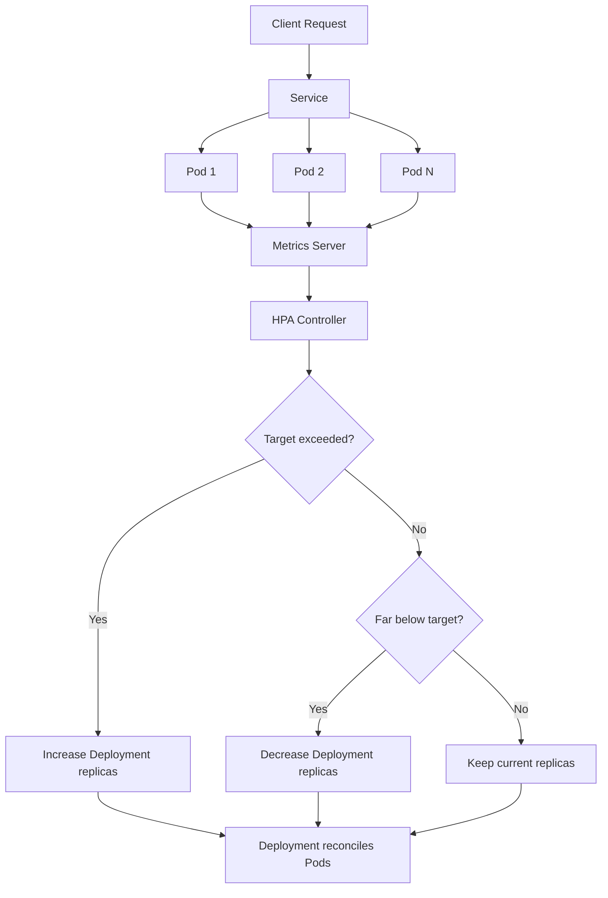

# HPA 학습노트

## 1. HPA란 무엇인가

HPA는 `Horizontal Pod Autoscaler`의 약자입니다.

핵심 역할은 아래와 같습니다.

- 현재 Pod들의 CPU/Memory 사용률을 본다
- 목표치보다 높으면 Pod 개수를 늘린다
- 목표치보다 낮으면 Pod 개수를 줄인다

즉, HPA는 애플리케이션 코드를 바꾸는 기능이 아니라 `Deployment의 replicas`를 자동으로 조절하는 Kubernetes 기능입니다.

---

## 2. 왜 필요한가

서비스 트래픽은 항상 일정하지 않습니다.

- 한가한 시간에는 Pod가 적어도 충분함
- 바쁜 시간에는 Pod가 더 많이 필요함

HPA를 사용하면 현재 부하에 맞춰 Pod 수를 자동으로 조절할 수 있습니다.

즉 목표는 두 가지입니다.

- 성능 안정성 확보
- 리소스 낭비 방지

---

## 3. HPA가 동작하려면 필요한 것

1. `Deployment`
2. `Service`
3. `resources.requests`
4. `HorizontalPodAutoscaler`
5. `Metrics Server`

각 역할은 다음과 같습니다.

- `Deployment`: Pod를 몇 개 유지할지 관리
- `Service`: 여러 Pod로 트래픽 분산
- `resources.requests`: HPA 계산 기준점
- `HPA`: 메트릭을 보고 replicas 자동 조절
- `Metrics Server`: 실제 CPU/Memory 사용량 수집

---

## 4. Kubernetes에서 실제로 어떻게 동작하는가

HPA는 혼자 동작하지 않습니다. Kubernetes 내부 컴포넌트가 함께 움직입니다.

### 동작 순서

1. 사용자가 `Deployment`와 `HPA`를 배포합니다.
2. `Deployment`가 Pod를 생성합니다.
3. Pod가 실제 CPU/Memory를 사용합니다.
4. `Metrics Server`가 Pod 사용량을 수집합니다.
5. `HPA Controller`가 메트릭을 주기적으로 확인합니다.
6. 목표치보다 높으면 `Deployment.spec.replicas`를 늘립니다.
7. 목표치보다 낮으면 `Deployment.spec.replicas`를 줄입니다.
8. `Service`는 현재 살아 있는 Pod들로 트래픽을 분산합니다.

---

## 5. ASCII 그림으로 보는 구조

```text
                   +----------------------+
                   |   User / Client      |
                   +----------+-----------+
                              |
                              v
                   +----------------------+
                   |      Service         |
                   |  (Traffic Router)    |
                   +----------+-----------+
                              |
                +-------------+-------------+
                |             |             |
                v             v             v
         +-------------+ +-------------+ +-------------+
         |   Pod A     | |   Pod B     | |   Pod C     |
         | FastAPI App | | FastAPI App | | FastAPI App |
         +------+------+ +------+------+ +------+------+
                |               |               |
                +---------------+---------------+
                                |
                                v
                     +----------------------+
                     |   Metrics Server     |
                     | CPU / Memory Usage   |
                     +----------+-----------+
                                |
                                v
                     +----------------------+
                     |   HPA Controller     |
                     | Compare with target  |
                     +----------+-----------+
                                |
                                v
                     +----------------------+
                     |     Deployment       |
                     | replicas up / down   |
                     +----------------------+
```

---

## 6. Mermaid로 보는 제어 흐름



---

## 7. HPA는 무엇을 기준으로 판단하는가

기본 HPA는 보통 아래 메트릭을 사용합니다.

- CPU 사용률
- Memory 사용률

예를 들어:

```yaml
targetCPUUtilizationPercentage: 70
targetMemoryUtilizationPercentage: 80
```

의 의미는 다음과 같습니다.

- CPU 평균 사용률을 `requests.cpu` 대비 70% 근처로 유지하고 싶다
- Memory 평균 사용률을 `requests.memory` 대비 80% 근처로 유지하고 싶다

중요한 점은 `노드 전체 사용률`이 아니라 `Pod에 선언한 requests 대비 사용률`이라는 점입니다.

---

## 8. requests는 왜 중요한가

예를 들어 아래처럼 선언합니다.

```yaml
requests:
  cpu: "256m"
  memory: "256Mi"
```

이 뜻은:

- 이 컨테이너는 최소 CPU `256m`
- 이 컨테이너는 최소 Memory `256Mi`

정도를 필요로 한다는 선언입니다. 이 값은 환경변수처럼 Kubernetes 시스템이 읽는 값입니다.

### 누가 읽는가

- `Scheduler`: 어느 노드에 Pod를 배치할지 판단
- `HPA`: 현재 사용률 계산의 기준점으로 사용

즉 `requests`는 HPA 계산의 분모 역할을 합니다.

---

## 9. stabilizationWindowSeconds란

이 값은 메트릭 결과를 얼마나 즉시 반영할지 결정하는 완충 장치입니다.

### scaleUp이 0인 경우

```yaml
scaleUp:
  stabilizationWindowSeconds: 0
```

의미:

- 현재 메트릭이 높으면 거의 바로 반응
- Pod를 빠르게 늘리기 쉬움

### scaleDown이 300인 경우

```yaml
scaleDown:
  stabilizationWindowSeconds: 300
```

의미:

- 최근 5분 정도를 보고 천천히 줄임
- 잠깐 부하가 줄었다고 바로 줄이지 않음

즉 이 값은 HTTP request 수와 직접 비교하는 값이 아니라, `HPA가 계산한 추천 replica 변경을 얼마나 보수적으로 적용할지` 정하는 값입니다.

---

## 10. 설계 관점에서의 디자인 패턴

엔터프라이즈 관점에서는 HPA를 `관심사 분리`로 이해하면 좋습니다.

### 책임 분리 패턴

- `Application`: 요청 처리만 담당
- `Deployment`: Pod 배포/복구 담당
- `Service`: 트래픽 라우팅 담당
- `HPA`: 스케일링 정책 담당
- `values.yaml`: 환경별 설정 담당

이 구조는 아래 원칙과 잘 맞습니다.

- `SRP (Single Responsibility Principle)`
- `Separation of Concerns`
- `Configuration Externalization`

---

## 11. 추천 디자인 패턴

### 패턴 1. 설정 외부화

스케일링 정책은 코드가 아니라 `values.yaml`에 둡니다.

장점:

- 환경별 설정 분리 가능
- dev / stg / prd 운영 쉬움
- 코드 수정 없이 정책 변경 가능

예시:

```yaml
hpa:
  enabled: true
  minReplicas: 1
  maxReplicas: 5
  targetCPUUtilizationPercentage: 70
  targetMemoryUtilizationPercentage: 80
```

### 패턴 2. 리소스 파일 분리

아래처럼 역할별로 나눕니다.

- `deployment.yaml`
- `service.yaml`
- `hpa.yaml`
- `configmap.yaml`
- `secret.yaml`

장점:

- 변경 범위가 명확함
- 읽기 쉬움
- 운영 시 디버깅 쉬움

### 패턴 3. 이름 일관성

이름 전략은 끝까지 통일해야 합니다.

예시:

- `{{ .Release.Name }}`
- `{{ .Release.Name }}-service`
- `{{ .Release.Name }}-hpa`
- `{{ .Release.Name }}-config`
- `{{ .Release.Name }}-secret`

장점:

- selector mismatch 방지
- Argo CD / Helm release 단위 식별 쉬움
- 운영 중 문제 추적이 쉬움

### 패턴 4. 빠른 scale up, 느린 scale down

실무에서는 보통 아래처럼 설계합니다.

- `scale up`은 빠르게
- `scale down`은 천천히

이유:

- scale up이 늦으면 응답 지연이나 장애로 이어질 수 있음
- scale down이 너무 빠르면 부하 재증가 때 흔들림 발생

---

## 12. 샘플 values.yaml

```yaml
image:
  repository: ghcr.io/example/backend
  tag: "latest"
  pullPolicy: Always

containers:
  replicas: 1
  requests:
    cpu: "256m"
    memory: "256Mi"
  limits:
    cpu: "512m"
    memory: "512Mi"

service:
  port: 80
  targetPort: 8080

hpa:
  enabled: true
  minReplicas: 1
  maxReplicas: 5
  targetCPUUtilizationPercentage: 70
  targetMemoryUtilizationPercentage: 80
  behavior:
    scaleUp:
      stabilizationWindowSeconds: 0
    scaleDown:
      stabilizationWindowSeconds: 300
```

---

## 13. 샘플 deployment.yaml

```yaml
apiVersion: apps/v1
kind: Deployment
metadata:
  name: {{ .Release.Name }}
  namespace: {{ .Release.Namespace }}
spec:
  replicas: {{ .Values.containers.replicas }}
  selector:
    matchLabels:
      app: {{ .Release.Name }}
  template:
    metadata:
      labels:
        app: {{ .Release.Name }}
    spec:
      containers:
        - name: {{ .Release.Name }}
          image: "{{ .Values.image.repository }}:{{ .Values.image.tag }}"
          imagePullPolicy: {{ .Values.image.pullPolicy }}
          ports:
            - containerPort: {{ .Values.service.targetPort }}
          resources:
            requests:
              cpu: {{ .Values.containers.requests.cpu | quote }}
              memory: {{ .Values.containers.requests.memory | quote }}
            limits:
              cpu: {{ .Values.containers.limits.cpu | quote }}
              memory: {{ .Values.containers.limits.memory | quote }}
          readinessProbe:
            httpGet:
              path: /healthz
              port: {{ .Values.service.targetPort }}
            initialDelaySeconds: 10
            periodSeconds: 30
          envFrom:
            - configMapRef:
                name: {{ .Release.Name }}-config
            - secretRef:
                name: {{ .Release.Name }}-secret
```

---

## 14. 샘플 service.yaml

```yaml
apiVersion: v1
kind: Service
metadata:
  name: {{ .Release.Name }}-service
spec:
  selector:
    app: {{ .Release.Name }}
  ports:
    - name: http
      port: {{ .Values.service.port }}
      targetPort: {{ .Values.service.targetPort }}
  type: ClusterIP
```

---

## 15. 샘플 hpa.yaml

```yaml
{{- if .Values.hpa.enabled }}
apiVersion: autoscaling/v2
kind: HorizontalPodAutoscaler
metadata:
  name: {{ .Release.Name }}-hpa
spec:
  scaleTargetRef:
    apiVersion: apps/v1
    kind: Deployment
    name: {{ .Release.Name }}

  minReplicas: {{ .Values.hpa.minReplicas }}
  maxReplicas: {{ .Values.hpa.maxReplicas }}

  behavior:
    scaleUp:
      stabilizationWindowSeconds: {{ .Values.hpa.behavior.scaleUp.stabilizationWindowSeconds }}
      policies:
        - type: Percent
          value: 100
          periodSeconds: 60

    scaleDown:
      stabilizationWindowSeconds: {{ .Values.hpa.behavior.scaleDown.stabilizationWindowSeconds }}
      policies:
        - type: Percent
          value: 50
          periodSeconds: 60

  metrics:
    - type: Resource
      resource:
        name: cpu
        target:
          type: Utilization
          averageUtilization: {{ .Values.hpa.targetCPUUtilizationPercentage }}

    - type: Resource
      resource:
        name: memory
        target:
          type: Utilization
          averageUtilization: {{ .Values.hpa.targetMemoryUtilizationPercentage }}
{{- end }}
```

---

## 16. Kubernetes는 YAML을 어떻게 인지하는가

Kubernetes는 YAML을 단순 저장하지 않고, 각 리소스를 보고 `원하는 상태(desired state)`를 맞추려는 방식으로 동작합니다.

예를 들면:

- `Deployment`: Pod를 몇 개 유지해야 하는가
- `Service`: 어떤 Pod 집합에 트래픽을 보낼 것인가
- `HPA`: 언제 Pod 개수를 늘리고 줄일 것인가

즉 Kubernetes는 계속 다음 질문을 반복합니다.

```text
Deployment:
  원하는 Pod 개수는 몇 개인가?

Service:
  어떤 Pod에 트래픽을 보내야 하는가?

HPA:
  현재 메트릭 기준으로 replicas를 바꿔야 하는가?
```

이런 controller 기반 구조 덕분에 실제 상태가 변해도 계속 원하는 상태로 맞추려고 합니다.

---

## 17. 주니어 엔지니어가 자주 하는 실수

### 실수 1. requests 없이 HPA 설정

문제:

- HPA가 Utilization 계산 기준을 제대로 못 잡음

### 실수 2. selector와 label 불일치

문제:

- Service가 Pod를 못 찾음
- Deployment가 Pod 집합을 정확히 관리하지 못함

### 실수 3. HPA 대상 Deployment 이름 불일치

문제:

- HPA가 scale target을 찾지 못함

### 실수 4. values.yaml 경로와 템플릿 경로 불일치

문제:

- Helm 렌더링 실패
- 값이 비어 있는 리소스 생성

### 실수 5. Metrics Server 없는 환경

문제:

- HPA 리소스는 있어도 메트릭이 없어 실제 동작하지 않음

---

## 18. HPA와 KEDA의 차이

### HPA

- Kubernetes 기본 오토스케일링
- CPU / Memory 중심
- 구조가 단순함
- 처음 배우기에 좋음

### KEDA

- 이벤트 기반 오토스케일링 확장
- Queue, Kafka lag, Cron, 외부 이벤트 기준 가능
- 더 강력하지만 개념이 하나 더 늘어남

처음에는 `HPA -> KEDA` 순서로 학습하는 것이 좋습니다.

---

## 19. Argo CD와 Release.Name

Helm 템플릿의 `{{ .Release.Name }}` 는 `Chart.yaml`의 `name`이 아닙니다.

Argo CD에서는 보통 다음 기준으로 정해집니다.

- 기본적으로 `Application.metadata.name`
- 또는 `spec.source.helm.releaseName` 이 있으면 그 값

그래서 네이밍 전략을 `{{ .Release.Name }}` 기반으로 잡았다면, `Deployment`, `Service`, `HPA`, `ConfigMap`, `Secret`에서 모두 일관되게 사용하는 것이 중요합니다.

---

## 20. 학습용 체크리스트

HPA를 새로 설계할 때는 아래 순서로 보면 좋습니다.

1. 앱이 stateless에 가까운가?
2. Deployment에 requests/limits가 있는가?
3. Service selector와 Pod label이 일치하는가?
4. HPA target이 실제 Deployment 이름과 일치하는가?
5. values.yaml 경로와 템플릿 경로가 일치하는가?
6. Metrics Server가 설치되어 있는가?
7. scaleUp / scaleDown 정책이 운영 목적에 맞는가?

---

## 21. 한 줄 요약

HPA의 본질은 이것입니다.

`애플리케이션은 요청 처리에 집중하고, Kubernetes는 메트릭을 보고 Pod 개수를 자동으로 조절한다.`

즉 좋은 HPA 설계란:

- 기준값이 명확하고
- 이름 규칙이 일관되고
- 설정이 외부화되어 있고
- 실제 운영 흐름이 예측 가능한 상태

를 만드는 것입니다.
